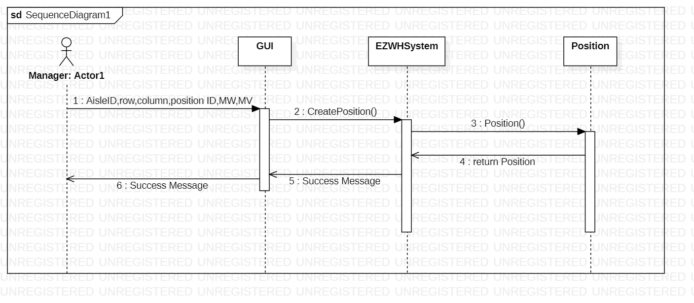

# Design Document

Authors: Andriano Davide, Hakimifard Pouya, Sunder Giulio, Talakoobi Alireza

Date: 27-04-2022

Version: 1.0

# Contents

- [Design Document](#design-document)
- [Contents](#contents)
- [Instructions](#instructions)
- [High level design](#high-level-design)
- [Low level design](#low-level-design)
- [Verification traceability matrix](#verification-traceability-matrix)
- [Verification sequence diagrams](#verification-sequence-diagrams)

# Instructions

The design must satisfy the Official Requirements document

# High level design

The pattern used for our project is a Three-Tier layered MVC pattern. The application must collect informations, use and modify them showing the changes on the view layer.

# Low level design

The class diagram implements a facade structural pattern, which is the EZWHSystem class, for interfacing with all the classes of the model.

# Verification traceability matrix

| Function | EZWHSystem | TestDescriptor | Position | RestockOrder | InternalOrder | TestResult | ReturnOrder | SKUItem | SKU | Item | User |
| :------: | :--------: | :------------: | :------: | :----------: | :-----------: | :--------: | :---------: | :-----: | :-: | :--: | :--: |
|   FR1    |     ×      |                |          |              |               |            |             |         |     |      |  ×   |
|   FR2    |     ×      |                |    ×     |              |               |            |             |         |  ×  |      |      |
|   FR3    |     ×      |       x        |    ×     |              |               |     x      |             |         |     |      |      |
|   FR4    |     ×      |                |          |              |               |            |             |         |     |      |  ×   |
|   FR5    |     ×      |                |          |      ×       |               |     x      |      x      |    x    |  x  |  x   |      |
|   FR6    |     ×      |                |          |              |       ×       |            |             |    x    |  x  |      |      |
|   FR7    |     ×      |                |          |              |               |            |             |         |  x  |  ×   |  x   |

# Verification sequence diagrams

##Scenario 1.1  
  
##Scenario 2.1  
  
##Scenario 3.2  
  
##Scenario 4.1  
  
##Scenario 5.1.1  
  
##Scenario 5.2.1  
  
##Scenario 5.3.1  
  
##Scenario 6.1  
  
##Scenario 7.1  
  
##Scenario 9.1 & 10.1  
  
##Scenario 11.1  
  
##Scenario 12.1  

