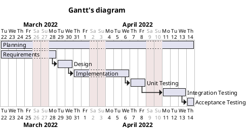

# Project Estimation

Authors: Andriano Davide, Hakimifard Pouya, Sunder Giulio, Talakoobi Alireza
Date: 22 march 2022
Version: 1.0

# Contents

- [Estimate by product decomposition]
- [Estimate by activity decomposition ]

# Estimation approach

We have considered our requirements document for EzWH project.
The applied procedure has been Delphi approached to evaluate the following estimates.

# Estimate by product decomposition

###

|                                                                                                                      | Estimate          |
| -------------------------------------------------------------------------------------------------------------------- | ----------------- |
| NC = Estimated number of classes to be developed                                                                     | 19                |
| A = Estimated average size in LOC per class                                                                          | 200               |
| S = Estimated size in LOC of project (= NC \* A)                                                                     | 3800              |
| E = Estimated effort, in person hours (productivity as 8 LOC per person hour, considering implementation phase only) | 475               |
| C = Estimated cost, in euro (for example 1 person hour cost = 45 euro)                                               | € 21375           |
| Estimated calendar time, in calendar weeks (Assume team of 4 people, 8 hours per day, 5 days per week )              | 4 weeks (18 days) |

# Estimate by activity decomposition

###

> The following activity decomposition refers to a team of experts in their field, for this reason the following estimation do not match with stated person hours in TimeSheet.md

| Activity name       | Estimated effort (person hours) |
| ------------------- | ------------------------------- |
| Planning            | 12                              |
| Requirements        | 65                              |
| Design              | 55                              |
| Implementation      | 110                             |
| Unit testing        | 40                              |
| Integration testing | 100                             |
| Acceptance testing  | 20                              |

###

