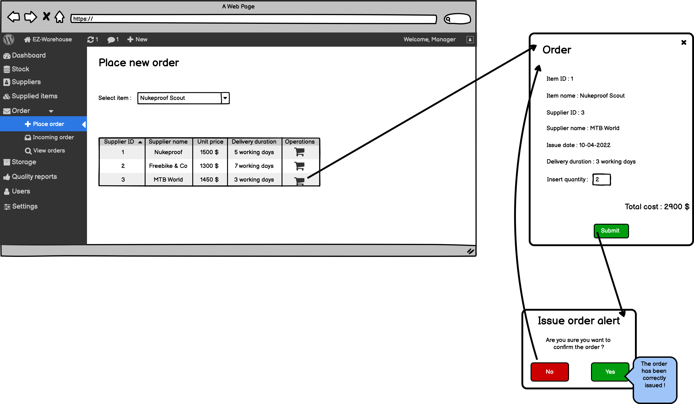

# Graphical User Interface Prototype

Authors: Andriano Davide, Hakimifard Pouya, Sunder Giulio, Talakoobi Alireza
Date: 22 march 2022
Version: 1.0

## Dashboard

## UC1: Manager User

### including use cases UC1.1, UC1.2, UC1.3, 1.4 and scenario 1.1.1,1.1.2,1.2.1,1.3.1,1.4.1

## UC2: Manage Personal Data

### Scenario 2.1

## UC3: Manage Authentication

### include UC3.1, UC3.3 and scenario 3.1.1,3.3.1

## UC3.2: Logout

### scenario 3.2.1

## UC4: Lost Connection

## UC5: Create Internal Order

### including scenario 5.1.1-5.1.2

## UC6: Manage Quality Reports

### including use cases 6.1-6.1.1 and scenario 6.1.1-6.1.2-6.1.1.1-6.1.1.2

## UC7: Manage Stock

### including use cases UC 7.1, UC 7.2, UC 7.3, UC 7.4, UC 7.5 and scenario 7.1.1 ,7.1.2,7.2.1,7.3.1,7.3.2,7.4.1,7.5.1

## UC8: Manage Orders

### including use cases UC 8.1 and scenario 8.1.1-8.1.2

## UC 8.2: Incoming order

### scenario: 8.2.1,8.2.2

## UC 8.3: View Orders

### scenario 8.3.1

## UC9.1 Manage storage

### including use cases 9.1.1, 9.1.2, 9.1.3, 9.1.4 and scenario 9.1.1.1,9.1.1.2, 9.1.2.1, 9.1.3.1, 9.1.4.1

### UC9.2 Manage order queue

## UC10 Manage Suppliers

### including use cases 10.1,10.2,10.3 and scenario 10.1.1,10.2.1,10.3.1

## UC11 Manage Items

### including use cases 11.1,11.2,11.3 and scenario 11.1.1,11.2.1,11.3.1

