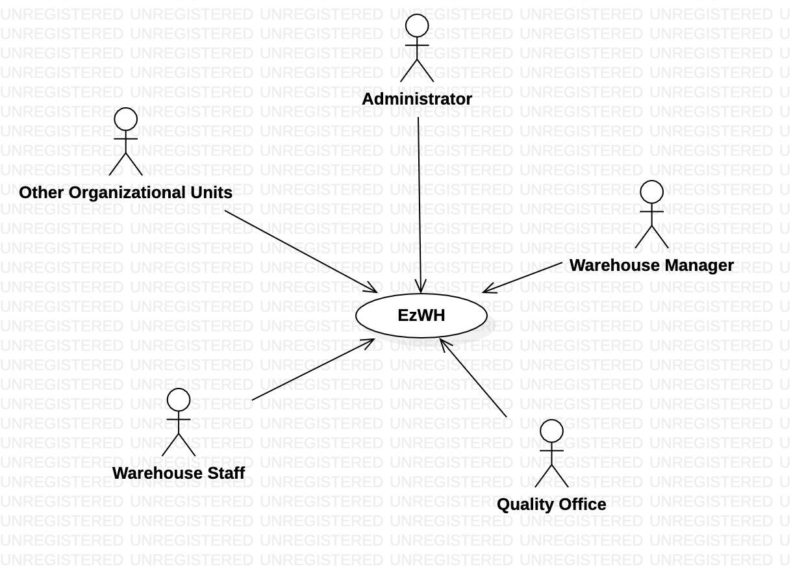
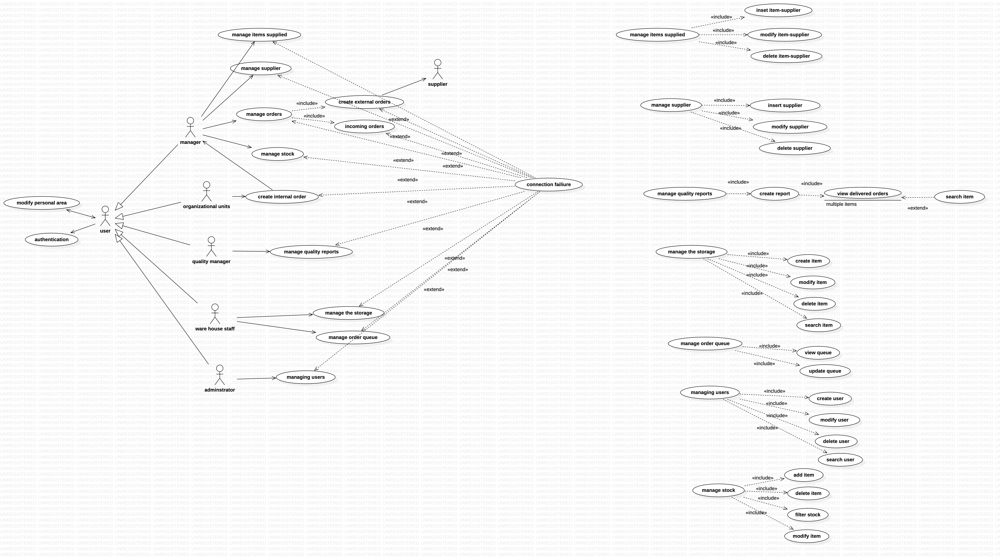
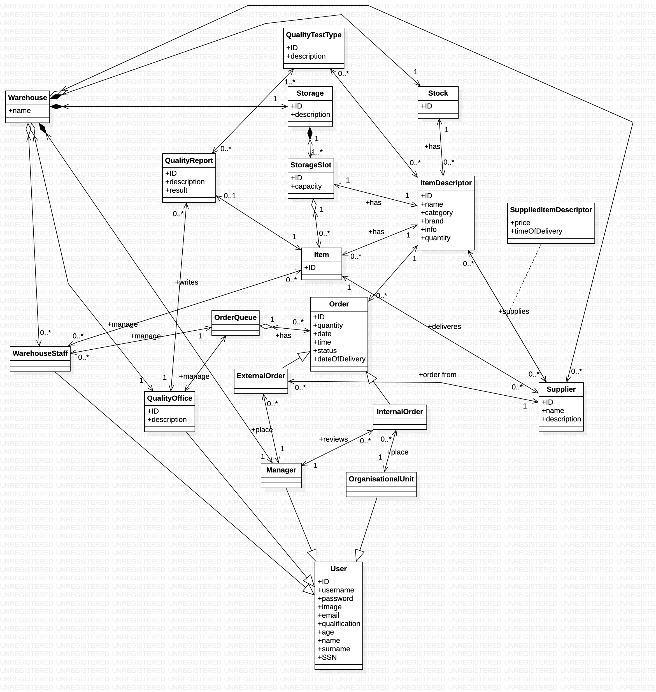
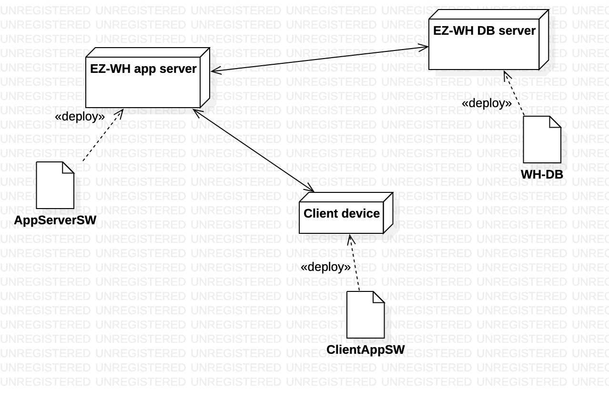

#Requirements Document

Authors: Andriano Davide, Hakimifard Pouya, Sunder Giulio, Talakoobi Alireza
Date: 22 march 2022

Version: 1.0

# Contents

- [Contents](#contents)
- [Informal description](#informal-description)
- [Stakeholders](#stakeholders)
- [Context Diagram and interfaces](#context-diagram-and-interfaces)
	- [Context Diagram](#context-diagram)
	- [Interfaces](#interfaces)
- [Stories and personas](#stories-and-personas)
		- [Manager](#manager)
- [Functional and non functional requirements](#functional-and-non-functional-requirements)
	- [Functional Requirements](#functional-requirements)
	- [Access rights](#access-rights)
	- [Non Functional Requirements](#non-functional-requirements)
- [Use case diagram and use cases](#use-case-diagram-and-use-cases)
	- [Use case diagram](#use-case-diagram)
		- [Manager User, UC1](#manager-user-uc1)
		- [UC1.1: Create new user](#uc11-create-new-user)
			- [Scenario 1.1.1](#scenario-111)
			- [Scenario 1.1.2](#scenario-112)
		- [UC1.2: Delete user](#uc12-delete-user)
		- [UC1.3: Search user](#uc13-search-user)
		- [UC1.4: Modify user](#uc14-modify-user)
		- [UC2: Manage Personal Data](#uc2-manage-personal-data)
			- [Scenario 2.1](#scenario-21)
		- [UC3: Manage Authentication](#uc3-manage-authentication)
		- [UC3.1: Log in](#uc31-log-in)
			- [Scenario 3.1.1](#scenario-311)
		- [UC3.2: Logout](#uc32-logout)
			- [Scenario 3.2.1](#scenario-321)
		- [UC3.3: Recover Password](#uc33-recover-password)
			- [Scenario 3.3.1](#scenario-331)
		- [UC4: Lost Connection](#uc4-lost-connection)
		- [UC5: Create Internal Order](#uc5-create-internal-order)
			- [Scenario 5.1.1](#scenario-511)
			- [Scenario 5.1.2](#scenario-512)
		- [UC6: Manage Quality Reports](#uc6-manage-quality-reports)
		- [UC6.1: Create Report](#uc61-create-report)
			- [Scenario 6.1.2](#scenario-612)
		- [UC6.1.1:](#uc611)
			- [Scenario 6.1.1.1 View pending orders](#scenario-6111-view-pending-orders)
			- [Scenario 6.1.1.2 View pending orders](#scenario-6112-view-pending-orders)
		- [UC7: Manage stock](#uc7-manage-stock)
		- [UC7.1: Add item](#uc71-add-item)
			- [Scenario 7.1.1](#scenario-711)
			- [Scenario 7.1.2](#scenario-712)
		- [UC 7.2: Delete item](#uc-72-delete-item)
			- [Scenario 7.2.1](#scenario-721)
		- [UC7.3: Modify item](#uc73-modify-item)
			- [Scenario 7.3.1](#scenario-731)
			- [Scenario 7.3.2](#scenario-732)
		- [UC7.4: Filter stock](#uc74-filter-stock)
			- [Scenario 7.4.1](#scenario-741)
		- [UC7.5: View item details](#uc75-view-item-details)
			- [Scenario 7.5.1](#scenario-751)
		- [UC8: Manage orders](#uc8-manage-orders)
		- [UC8.1: Place order](#uc81-place-order)
			- [Scenario 8.1.1](#scenario-811)
			- [Scenario 8.1.2](#scenario-812)
		- [UC8.2: Incoming order](#uc82-incoming-order)
			- [Scenario 8.2.1](#scenario-821)
			- [Scenario 8.2.2](#scenario-822)
			- [Scenario 8.2.3](#scenario-823)
		- [UC8.3: View + filter orders](#uc83-view--filter-orders)
			- [Scenario 8.3.1](#scenario-831)
		- [UC9 Warehouse staff:](#uc9-warehouse-staff)
		- [UC9.1 Manage storage:](#uc91-manage-storage)
		- [UC9.1.1 create item:](#uc911-create-item)
			- [Scenario 9.1.1.1](#scenario-9111)
			- [Scenario 9.1.1.2](#scenario-9112)
		- [UC9.1.2 Modify item:](#uc912-modify-item)
			- [Scenario 9.1.2.1](#scenario-9121)
		- [UC9.1.3 Delete item:](#uc913-delete-item)
			- [Scenario 9.1.3.1](#scenario-9131)
		- [UC9.1.4 Search item:](#uc914-search-item)
			- [Scenario 9.1.4.1](#scenario-9141)
		- [UC9.2 Manage order queue:](#uc92-manage-order-queue)
		- [UC9.2.1 view queue:](#uc921-view-queue)
			- [Scenario 9.2.1.1](#scenario-9211)
			- [Scenario 9.2.1.2](#scenario-9212)
		- [UC9.2.2 update queue:](#uc922-update-queue)
			- [Scenario 9.2.2.1](#scenario-9221)
		- [UC10: Manage Suppliers](#uc10-manage-suppliers)
		- [UC10.1 Add new supplier](#uc101-add-new-supplier)
			- [Scenario 10.1.1](#scenario-1011)
		- [UC10.2 Delete supplier](#uc102-delete-supplier)
			- [Scenario 10.2.1](#scenario-1021)
		- [UC10.3 Modify supplier](#uc103-modify-supplier)
			- [Scenario 10.3.1](#scenario-1031)
		- [UC11: Manage Items](#uc11-manage-items)
		- [UC11.1 Add item](#uc111-add-item)
			- [Scenario 11.1.1](#scenario-1111)
		- [UC11.2 Delete item](#uc112-delete-item)
			- [Scenario 11.2](#scenario-112-1)
		- [UC11.3 Modify item](#uc113-modify-item)
			- [Scenario 11.3.1](#scenario-1131)
- [Glossary](#glossary)
- [System Design](#system-design)
				- [No needing of system design since the WH management system is composed by software application only](#no-needing-of-system-design-since-the-wh-management-system-is-composed-by-software-application-only)
- [Deployment Diagram](#deployment-diagram)

# Informal description

Medium companies and retailers need a simple application to manage the relationship with suppliers and the inventory of physical items stocked in a physical warehouse.
The warehouse is supervised by a manager, who supervises the availability of items. When a certain item is in short supply, the manager issues an order to a supplier. In general the same item can be purchased by many suppliers. The warehouse keeps a list of possible suppliers per item.

After some time the items ordered to a supplier are received. The items must be quality checked and stored in specific positions in the warehouse. The quality check is performed by specific roles (quality office), who apply specific tests for item (different items are tested differently). Possibly the tests are not made at all, or made randomly on some of the items received. If an item does not pass a quality test it may be rejected and sent back to the supplier.

Storage of items in the warehouse must take into account the availability of physical space in the warehouse. Further the position of items must be traced to guide later recollection of them.

The warehouse is part of a company. Other organizational units (OU) of the company may ask for items in the warehouse. This is implemented via internal orders, received by the warehouse. Upon reception of an internal order the warehouse must collect the requested item(s), prepare them and deliver them to a pick up area. When the item is collected by the other OU the internal order is completed.

EZWH (EaSy WareHouse) is a software application to support the management of a warehouse.

# Stakeholders

| Stakeholder name                  |                                                                           Description                                                                           |
| --------------------------------- | :-------------------------------------------------------------------------------------------------------------------------------------------------------------: |
| Suppliers                         |                                                 Company or vendor who owns the items supplied to the warehouse                                                  |
| Customers                         |                                                   Clients that buy items have an impact on their availability                                                   |
| Administrator                     |                                Manages the company and people working in the warehouse and connected departments, has all rights                                |
| Manager                           |                    Manages the warehouse, the stock and places the orders in case it's needed, the latter can be either internal or external                    |
| Delivery Service                  |                                                  External delivery service between warehouse and the suppliers                                                  |
| Company                           |                                                  company that uses the application for managing the warehouse                                                   |
| Organizational units              |                                                   Departments in the warehouse that can place internal orders                                                   |
| Software Development Organization |                                                  Office working on patches or updates of the sold application                                                   |
| Customer Service                  |                                                           Internal office handling customers requests                                                           |
| Payment System                    |                                               External system handling the payments between Company and Retailer                                                |
| Analyst                           |                                                           Expert in the software for business domain                                                            |
| Quality Office                    |                                                            The office that perform the quality tests                                                            |
| Warehouse Staff                   | The staff who run the requests received in the warehouse, manage the availability in the warehouse and deliver the orders in specific spots for internal orders |

# Context Diagram and interfaces

## Context Diagram

## Interfaces

| Actor                | Logical Interface |       Physical Interface |
| -------------------- | :---------------: | -----------------------: |
| Manager              |        GUI        | Monitor, Keyboard, Mouse |
| Quality office       |        GUI        | Monitor, Keyboard, Mouse |
| Warehouse staff      |        GUI        | Monitor, Keyboard, Mouse |
| Administrator        |        GUI        | Monitor, Keyboard, Mouse |
| Organizational Units |        GUI        | Monitor, Keyboard, Mouse |

# Stories and personas

### Manager

Marie, 30 years old, Female:
She checks the number of stocks of an item and notices that the company has a few numbers of them. She goes to the ordering section of the website, looks for possible suppliers of that item, chooses one, and makes the order.
###Administrator
Stanley, 25, male:
There is a new employee in the company and he needs an account to be able to use the website. The administrator needs to make a new account for that user, and give the user enough authentication based on his role so that he can use the website.
###Quality office staff
Mark, 36, male:
He is a very well experienced staff in the office, he chooses randomly an item and while quality checking the new items received with specific techniques he notices some defects in some of them. He then writes full reports for these items and returns it to the supplier.
###Warehouse staff
Dan, 28, male:
The warehouse staff receives an order from the manager of the company for a specific internal order. He needs to look for that item in the warehouse database in order to get its location and after sending the order he needs to update the warehouse database so that the manager knows about the updated stocks and also about the updated empty spaces inside the warehouse, and the UI can know where to pick up them.
###Other Organizational unit manager
Gabrielle, female, 38:
She notices that they are in need of a new item inside their department and so she puts an order for this item on the website, once notified to the manager, the latter issues an internal order and the warehouse staff gets notified about it and sends these items to a delivery point in the shortest time possible.

# Functional and non functional requirements

## Functional Requirements

| ID    |                                        Description                                         |
| ----- | :----------------------------------------------------------------------------------------: |
| FR 1  |                                        Manage stock                                        |
| 1.1   |                       View list of all items in stock (with details)                       |
| 1.2   |                              Filter an item in stock by name                               |
| 1.3   |                                    Add an item to stock                                    |
| 1.4   |                                 Remove an item from stock                                  |
| 1.5   |                                  Modify an item in stock                                   |
| FR 2  |                                   Manage items Supplied                                    |
| 2.1   |  Add a supplied item (in stock) for a given registered supplier (with price and details)   |
| 2.2   | Modify a supplied item (in stock) for a given registered supplier (with price and details) |
| 2.3   | Remove a supplied item (in stock) for a given registered supplier (with price and details) |
| 2.4   |                                   Filter supplied items                                    |
| FR 3  |                                        Manage order                                        |
| 3.1   |            View list of orders with status and details(completed, pending, etc)            |
| 3.1.1 |                                    View internal orders                                    |
| 3.1.2 |                                    View external orders                                    |
| 3.2   |                                    Search for an order                                     |
| 3.3   |                                 Update status of an order                                  |
| 3.4   |                                       Issue an order                                       |
| 3.4.1 |                         Internal order (from organizational units)                         |
| 3.4.2 |                               External order (to suppliers)                                |
| 3.5   |                             Accept internal order issued by OU                             |
| 3.6   |                                     Manage order queue                                     |
| 3.6.1 |                                    Incoming Item queue                                     |
| 3.6.2 |                                    Outgoing item queue                                     |
| FR 4  |                                       Manage storage                                       |
| 4.1   |                           Check/view available space in storage                            |
| 4.2   |                               Search for an item in storage                                |
| 4.3   |                                    Add item to storage                                     |
| 4.4   |                                  Remove item from storage                                  |
| 4.5   |                                   Modify item in storage                                   |
| FR5   |                                   Manage quality testing                                   |
| 5.1   |                  Insert new quality test report for an item in the queue                   |
| 5.1.1 |                               Choose test to be carried out                                |
| 5.2   |                                  List quality tests made                                   |
| FR 6  |                                        Manage users                                        |
| 6.1   |                                     Create a new user                                      |
| 6.2   |                                       Modify a user                                        |
| 6.3   |                                       Delete a user                                        |
| 6.4   |                                   View list of all users                                   |
| 6.5   |                                  View the details of user                                  |
| 6.6   |                                    Filter user by name                                     |
| FR 7  |                                   Manage authentication                                    |
| 7.1   |                                           Login                                            |
| 7.2   |                                           Logout                                           |
| 7.3   |                                      Recover Password                                      |
| FR 8  |                                    Modify Personal Data                                    |

## Access rights

| Function | Administrator | Manager | OU  | Quality Office | Warehouse Staff |
| :------: | :-----------: | :-----: | :-: | :------------: | :-------------: |
|    F1    |      NO       |   YES   | NO  |       NO       |       NO        |
|    F2    |      NO       |   YES   | NO  |       NO       |       NO        |
|    F3    |      NO       |   YES   | NO  |       NO       |       NO        |
|   F3.3   |      NO       |   YES   | NO  |       NO       |       YES       |
|  F3.1.1  |      NO       |   YES   | YES |       NO       |       NO        |
|  F3.1.2  |      NO       |   YES   | NO  |      YES       |       NO        |
|  F3.4.1  |      NO       |   NO    | YES |       NO       |       NO        |
|   F3.6   |      NO       |   NO    | NO  |       NO       |       YES       |
|  F3.6.1  |      NO       |   NO    | NO  |      YES       |       NO        |
|  F3.6.2  |      NO       |   NO    | YES |       NO       |       NO        |
|    F4    |      NO       |   NO    | NO  |      YES       |       NO        |
|   F4.1   |      NO       |   YES   | NO  |      YES       |       NO        |
|   F4.2   |      NO       |   YES   | NO  |      YES       |       NO        |
|   F5.1   |      NO       |   NO    | NO  |      YES       |       NO        |
|   F5.2   |      NO       |   YES   | NO  |      YES       |       NO        |
|    F6    |      YES      |   NO    | NO  |       NO       |       NO        |
|    F7    |      YES      |   YES   | YES |      YES       |       YES       |
|    F8    |      YES      |   YES   | YES |      YES       |       YES       |

## Non Functional Requirements

| ID    | Type (efficiency, reliability, ..) |                                                                                                                          Description                                                                                                                          | Refers to |
| ----- | :--------------------------------: | :-----------------------------------------------------------------------------------------------------------------------------------------------------------------------------------------------------------------------------------------------------------: | --------: |
| NFR1  |             Usability              |                                                                                                    Application should be user friendly and simple to use.                                                                                                     |    ALL FR |
| NFR2  |              Privacy               |                                                 The data of one user should not be disclosed to other users. The identity of the user who worked with the software must be visible only for WH Administrator.                                                 |    ALL FR |
| NFR3  |              Security              |                                                                                                  The warehouse data can be accessed only by allowed workers                                                                                                   |    All FR |
| NFR4  |           Transportation           |                                         Time duration and the way of the transporting orders must be optimized specially for the type of materials that have low expiring duration or sensitive against temperature.                                          |         - |
| NFR5  |      Storage Standardization       |                                                                                             Classification and effective organization of the items inside the WH.                                                                                             |         - |
| NFR6  |       Order Standardization        | Manager should order the amount of items according to the capacity and also on time to prevent getting out of stock. Furthermore, the manager should make the best decision about choosing a supplier to make an order with highest quality and lowest price. |         - |
| NFR7  |        Account Policy Rules        |                                                              Length(8 charachters min) of the passwords and complexity(A special charachter, an upper case letter and a digit at least required)                                                              |         - |
| NFR8  |            Performance             |                                                                                                          All functions should complete in < 0.5 sec                                                                                                           |    ALL FR |
| NFR9  |            Reliability             |                                                                                                        The software must work properly 99% of the time                                                                                                        |    All FR |
| NFR10 |            Portability             |     The application should be accessed by Chrome and from the operating systems where these browsers are available (Android, IOS, Windows, MacOS, UNIX). As for devices, the application should be usable on smartphones (portrait) and PCs (landscape).      |    ALL FR |
| NFR11 |          Maintainability           |                                                                                                      The software must be updated or fixed in max 1 day                                                                                                       |    All FR |

# Use case diagram and use cases

## Use case diagram

### Manager User, UC1

| Actors Involved    |                                           Admin                                            |
| ------------------ | :----------------------------------------------------------------------------------------: |
| Precondition       | The system is fully set up and running, actor has an account and is logged into the system |
| Post condition     |               The system is fully running and administrator can manage users               |
| Includes use cases |                                  UC1.1, UC1.2, UC1.3, 1.4                                  |
| Nominal Scenario   |                              The actor clicks the "Users" tab                              |

### UC1.1: Create new user

| Actors Involved  |                                  Manager                                  |
| ---------------- | :-----------------------------------------------------------------------: |
| Precondition     | The user we are going to register is not already registered in the system |
| Post condition   |           The user has been correctly registered in the system            |
| Nominal Scenario |                              Scenario 1.1.1                               |
| Variants         |                                   1.1.2                                   |

#### Scenario 1.1.1

| Scenario ID: 1.1.1 | Corresponds to UC1.1                                                                                                                             |
| ------------------ | :----------------------------------------------------------------------------------------------------------------------------------------------- |
| Description        | The administrator adds a new user to the system                                                                                                  |
| Precondition       | The user account that has to be inserted doesn't exist                                                                                           |
| Postcondition      | The new user account is stored into the system                                                                                                   |
| Step#              | Step description                                                                                                                                 |
| 1                  | The administrator opens the 'users' page                                                                                                         |
| 2                  | The system shows all users                                                                                                                       |
| 3                  | The admin clicks onto the 'Add new user' button                                                                                                  |
| 4                  | The admin is prompted with filling a form with the required information about the user(it can be either a supplier or a worker of the warehouse) |
| 5                  | The admin fills the form                                                                                                                         |
| 6                  | The admin presses the 'Add user' button                                                                                                          |
| 7                  | If the form is not compiled correctly, the admin is prompted by the system to try again, repeating from step 4. Else, go to next step.           |
| 8                  | The system checks the email provided, if it has been already registered it shows an error message repeating from step 4. Else go further         |
| 9                  | The system creates a random password to the new user                                                                                             |
| 10                 | The system sends an email to the given email of the user with the random password created                                                        |

#### Scenario 1.1.2

| Scenario ID: 1.1.2 | Variant of use case 1.1                                                                                  |
| ------------------ | :------------------------------------------------------------------------------------------------------- |
| Description        | The administrator tries to add a new worker to the system, but then cancels the operation                |
| Precondition       | The account of the user that has to be inserted doesn't exist                                            |
| Postcondition      | No new suer has been inserted in the system                                                              |
| Step#              | Step description                                                                                         |
| 1                  | The admin opens the 'users' page                                                                         |
| 2                  | The admin clicks onto the 'Add new user' button                                                          |
| 3                  | The admin is prompted with filling a form with the required information about the worker                 |
| 4                  | The admin fills the form                                                                                 |
| 5                  | The admin presses the 'Cancel' button.                                                                   |
| 6                  | The system doesn't perform any insertion and the admin is prompted with a 'Operation cancelled' message. |

### UC1.2: Delete user

| Actors Involved  |                                   Administrator                                    |
| ---------------- | :--------------------------------------------------------------------------------: |
| Precondition     | The system is fully set up and running, administrator has an account and logged in |
| Post condition   |            The system is fully running and all modifications are saved             |
| Nominal Scenario |                                   Scenario 1.2.1                                   |
| Variants         |   If the administrator clicks onto the button "Cancel" the operation is aborted    |

| Scenario ID: 1.2.1 | Corresponds to UC1.2                                                         |
| ------------------ | :--------------------------------------------------------------------------- |
| Description        | The administrator deletes a user from the system                             |
| Precondition       | The user account exists                                                      |
| Postcondition      | The user account is removed from the system                                  |
| Step#              | Step description                                                             |
| 1                  | The administrator opens the 'users' page                                     |
| 2                  | The system shows all users                                                   |
| 3                  | The administrator clicks onto the user                                       |
| 4                  | The administrator clicks once onto the "Delete" button for the user selected |

### UC1.3: Search user

| Actors Involved  |                                   Administrator                                    |
| ---------------- | :--------------------------------------------------------------------------------: |
| Precondition     | The system is fully set up and running, administrator has an account and logged in |
| Post condition   |                 The system is fully running and the user is found                  |
| Nominal Scenario |                                   Scenario 1.3.1                                   |
| Variants         |   If the administrator clicks onto the button "Cancel" the operation is aborted    |

| Scenario ID: 1.3.1 | Corresponds to UC1.3                                                                       |
| ------------------ | :----------------------------------------------------------------------------------------- |
| Description        | The administrator searches a user in the system                                            |
| Precondition       | The user account exists                                                                    |
| Postcondition      | The user account is searched into the system                                               |
| Step#              | Step description                                                                           |
| 1                  | The administrator opens the 'users' page                                                   |
| 2                  | The system shows all users                                                                 |
| 3                  | The administrator clicks on the button search and fill the field and presses "Search User" |
| 4                  | The system checks for the user prompted and shows the user                                 |
| 5                  | If the user is not found into the database the system shows an errore message              |

### UC1.4: Modify user

| Actors Involved  |                                   Administrator                                    |
| ---------------- | :--------------------------------------------------------------------------------: |
| Precondition     | The system is fully set up and running, administrator has an account and logged in |
| Post condition   |            The system is fully running and all modifications are saved             |
| Nominal Scenario |                                   Scenario 1.4.1                                   |
| Variants         |   If the administrator clicks onto the button "Cancel" the operation is aborted    |

| Scenario ID: 1.4.1 | Corresponds to UC1.4                                                                       |
| ------------------ | :----------------------------------------------------------------------------------------- |
| Description        | The administrator modify the data of a user in the system                                  |
| Precondition       | The user account exists                                                                    |
| Postcondition      | The user account is modified into the system and data are saved into the system            |
| Step#              | Step description                                                                           |
| 1                  | The administrator opens the 'users' page                                                   |
| 2                  | The system shows all users                                                                 |
| 3                  | The administrator selects an user                                                          |
| 4                  | The system shows "delete" and "modify" buttons for the user selected                       |
| 5                  | The administrator clicks on the modify button                                              |
| 6                  | The systems shows a form filled with the data of the user and a button "Modify User"       |
| 7                  | The administrator modify all or some of the fields for the user and clicks onto the button |
| 8                  | The systems modifies the data inserted in the database for that given user                 |
| 8.1                | If an error occurs an error message is shown and it restarts from the point 4              |

### UC2: Manage Personal Data

| Actors Involved  |                                  User                                  |
| ---------------- | :--------------------------------------------------------------------: |
| Precondition     |   The software is fully set up, user has an account and is logged in   |
| Post condition   | The software system is fully running and the personal data are changed |
| Nominal scenario |                                  2.1                                   |
| Variants         |  If the user clicks onto the button "Cancel" the operation is aborted  |

#### Scenario 2.1

| Scenario ID: 2.1 | Corresponds to UC2                                                                         |
| ---------------- | :----------------------------------------------------------------------------------------- |
| Description      | The user modify its data in the system                                                     |
| Precondition     | The user account exists                                                                    |
| Postcondition    | The user account is modified into the system and data are saved into the database          |
| Step#            | Step description                                                                           |
| 1                | The user clicks on the button "Settings"                                                   |
| 2                | The system shows a form filled with the data of the user and a button "Modify"             |
| 3                | The user clicks onto the button "Modify"                                                   |
| 4                | The system shows a form with the fields to be modified                                     |
| 5                | The user modify the form and clicks on "save" button                                       |
| 6                | The system modifies the data inserted in the database for that given user                  |
| 6.1              | If an error occurs an error message is shown and it goes back to the interface of the user |

### UC3: Manage Authentication

| Actors Involved    | User                                                                            |
| ------------------ | :------------------------------------------------------------------------------ |
| Precondition       | The software is fully set up, user has an existing account                      |
| Post condition     | The software system is fully running and coherent with authentication functions |
| Include uses cases | UC3.1, UC3.2, UC3.3                                                             |
| Variants           | If the user clicks onto the button "Cancel" the operation is aborted            |

### UC3.1: Log in

| Actors Involved  |                          User                          |
| ---------------- | :----------------------------------------------------: |
| Precondition     | The system is fully running and the user is not logged |
| Post condition   |  The user is authenticated and logged into the system  |
| Nominal Scenario |                     Scenario 3.1.1                     |
| Variants         |

#### Scenario 3.1.1

| Scenario ID: 3.1.1 | Corresponds to UC3.1                                                                               |
| ------------------ | :------------------------------------------------------------------------------------------------- |
| Description        | The user is authenticated and logged into the system                                               |
| Precondition       | The user account exists and user is not logged                                                     |
| Postcondition      | The user is loggend into the system                                                                |
| Step#              | Step description                                                                                   |
| 1                  | The user goes to the login page                                                                    |
| 2                  | The system shows the "Log in" interface                                                            |
| 3                  | The user inserts its email and password                                                            |
| 4                  | The systems checks into the database if the users exists                                           |
| 4.1                | If the user is not found into the database an error message is shown and it returns to the point 3 |
| 5                  | The system goes to the personal interface of the user based on its role                            |

### UC3.2: Logout

| Actors Involved  |                        User                        |
| ---------------- | :------------------------------------------------: |
| Precondition     | The system is fully running and the user is logged |
| Post condition   |      The user is disconnected from the system      |
| Nominal Scenario |                   Scenario 3.2.1                   |
| Variants         |

#### Scenario 3.2.1

| Scenario ID: 3.2.1 | Corresponds to UC3.2                                                       |
| ------------------ | :------------------------------------------------------------------------- |
| Description        | The user is disconnected from the system                                   |
| Precondition       | The user is logged in                                                      |
| Postcondition      | The user is disconnected from the system                                   |
| Step#              | Step description                                                           |
| 1                  | The user clicks on the the menu button of his personal area                |
| 2                  | The system shows the menu interface which includes the "Disconnect" button |
| 3                  | The user clicks on the "Disconnect" button                                 |
| 4                  | The system disconnects the user and displays the Login area                |

### UC3.3: Recover Password

| Actors Involved  |                                 User                                 |
| ---------------- | :------------------------------------------------------------------: |
| Precondition     |        The system is fully running and the user is logged off        |
| Post condition   | An email containing a new password has been sent to the user's email |
| Nominal Scenario |                            Scenario 3.3.1                            |
| Variants         |    If the user clicks on "Cancel" button the operation is aborted    |

#### Scenario 3.3.1

| Scenario ID: 3.3.1 | Corresponds to UC3.3                                                                   |
| ------------------ | :------------------------------------------------------------------------------------- |
| Description        | The user can recover his password which has been lost                                  |
| Precondition       | The user is logged off                                                                 |
| Postcondition      | The user receives a new password to enters into the system                             |
| Step#              | Step description                                                                       |
| 1                  | The user clicks on the "Password Lost" of the Login interface                          |
| 2                  | The system shows a form containing the field "email" and "Recover password" button     |
| 3                  | The user inserts his email and clicks on "Recover password" button                     |
| 4                  | The system checks into the database if the email prompted exists                       |
| 4.1                | If the email doesn't exists an error message is shown and it restarts from the point 3 |
| 5                  | The system creates a new random password and sends it to the user email                |

### UC4: Lost Connection

| Actors Involved  |                                      |
| ---------------- | :----------------------------------: |
| Precondition     |     The software is fully set up     |
| Post condition   | The software system is fully running |
| Nominal scenario |                 4.1                  |
| Variants         |                                      |

| Scenario ID: 4.1 | Corresponds to UC4                                                          |
| ---------------- | :-------------------------------------------------------------------------- |
| Description      | The user is doing something with the system                                 |
| Precondition     | The user is logged in                                                       |
| Postcondition    | An error interface is shown                                                 |
| Step#            | Step description                                                            |
| 1                | The user is expleting a function with the system and a network error occurs |
| 2                | The system shows an error message                                           |
| 3                | The system returns to its function once connection is available             |

### UC5: Create Internal Order

| Actors Involved  |                                 Other Organizational Unit, Manager                                 |
| ---------------- | :------------------------------------------------------------------------------------------------: |
| Precondition     | The system is running, the OU is logged in and has the correct access rights to perform operations |
| Post condition   |             The system is correctly working and consistent with the issue of an order              |
| Nominal Scenario |                            Actor clicks the "Create Internal Order" tab                            |
| Variants         |                                               5.1.2                                                |

#### Scenario 5.1.1

| Scenario ID: 5.1.1 | Corresponds to UC5                                                                                                                                                     |
| ------------------ | :--------------------------------------------------------------------------------------------------------------------------------------------------------------------- |
| Description        | The organizational unit can ask for an internal order to the manager who's in charge of accept or reject it                                                            |
| Precondition       | The OU is correctly authenticated to perform operations                                                                                                                |
| Postcondition      | A notification has been sent to the Manager for the issued order                                                                                                       |
| Step#              | Step description                                                                                                                                                       |
| 1                  | The OU manager clicks on "Create internal order" button                                                                                                                |
| 2                  | The system shows an interface containing all the items by which choose and their available quantity and a field "Search"                                               |
| 3                  | The OU manager selects an item between those given                                                                                                                     |
| 4                  | The system shows next to the item selected a field "quantity" to fill for the quantity needed and a button "Confirm"                                                   |
| 5                  | The OU manager inserts the quantity needed and presses on "Confirm"                                                                                                    |
| 5.1                | If the quantity inserted is more than availability an error message is shown and it restart from the point 2. Else go further                                          |
| 6                  | The system shows an interface to the OU with a message "Order request has been sent to the Manager, wait for it's approvation" and sends a notification to the Manager |

#### Scenario 5.1.2

| Scenario ID: 5.1.2 | Corresponds to UC5                                                                                                                                                     |
| ------------------ | :--------------------------------------------------------------------------------------------------------------------------------------------------------------------- |
| Description        | The organizational unit can ask for an internal order to the manager who's in charge of accept or reject it                                                            |
| Precondition       | The OU is correctly authenticated to perform operations                                                                                                                |
| Postcondition      | A notification has been sent to the Manager for the issued order                                                                                                       |
| Step#              | Step description                                                                                                                                                       |
| 1                  | The OU manager clicks on "Create internal order" button                                                                                                                |
| 2                  | The system shows an interface containing all the items by which choose and their available quantity and a field "Search"                                               |
| 3                  | The OU manager fills the "search" field                                                                                                                                |
| 4                  | The system filters between all the items and shows the one filtered one(s)                                                                                             |
| 5                  | The OU manager selects the item                                                                                                                                        |
| 6                  | The system shows next to the item selected a field "quantity" to fill for the quantity needed and a button "Confirm"                                                   |
| 7                  | The OU manager inserts the quantity needed and presses on "Confirm"                                                                                                    |
| 7.1                | If the quantity inserted is more than availability an error message is shown and it restart from the point 2. Else go further                                          |
| 8                  | The system shows an interface to the OU with a message "Order request has been sent to the Manager, wait for it's approvation" and sends a notification to the Manager |

### UC6: Manage Quality Reports

| Actors Involved   | Quality Manager                                                                                 |
| ----------------- | :---------------------------------------------------------------------------------------------- |
| Precondition      | The system is fully running and the quality manager has been correctly authenticated            |
| Post condition    | The system is correctly working and consistent with quality manager functionalities             |
| Include use cases | 6.1                                                                                             |
| Variants          | If the Quality manager decides to abort the creation of a report he clicks on a "Cancel" button |

### UC6.1: Create Report

| Actors Involved   |                                    Quality Office                                    |
| ----------------- | :----------------------------------------------------------------------------------: |
| Precondition      | The system is fully running and the quality manager has been correctly authenticated |
| Post condition    |           The quality manager has accepted or rejected the incoming order            |
| Include use cases |                                        6.1.1                                         |
| Nominal Scenario  |                                        6.1.2                                         |
| Variants          |                                                                                      |

#### Scenario 6.1.2

| Scenario ID: 6.1.2 | refers to use case 6.1                                                                                                                                |
| ------------------ | :---------------------------------------------------------------------------------------------------------------------------------------------------- |
| Description        | The Quality Office make tests on an item and if it didn't pass the test it's marked as rejected and it's possible to create a description of the test |
| Precondition       | The user has clicked into "Create Report" button                                                                                                      |
| Postcondition      | The item is marked as Rejected and it's sent back to the supplier                                                                                     |
| Step#              | Step description                                                                                                                                      |
| 1                  | The user clicks on "Create Report"                                                                                                                    |
| 2                  | The system shows a form which contains field "Description" , a flag "reject" and a button "Confirm"                                                   |
| 3                  | The item user marks it a rejected and write down a description of the test made and then clicks on "Confirm"                                          |
| 4                  | The system saves the description for the order/item and it's marked as Rejected                                                                       |

### UC6.1.1:

| Actors Involved  |                                         Quality Office                                          |
| ---------------- | :---------------------------------------------------------------------------------------------: |
| Precondition     |         The quality manger is authenticated and has opened his "Create Report" section          |
| Post condition   | The quality office manager has choosen one among the pending orders(those needed to be checked) |
| Nominal Scenario |                                             6.1.1.1                                             |
| Variants         |                                             6.1.1.2                                             |

#### Scenario 6.1.1.1 View pending orders

| Scenario ID: 6.1.1.1 | Refers to use case 6.1.1.1                                                                                                                                             |
| -------------------- | :--------------------------------------------------------------------------------------------------------------------------------------------------------------------- |
| Description          | The quality office manager has choosen one among the delivered(but in pending status) orders which needs to be tested out and for which a report has to be carried out |
| Precondition         | The quality office manager is authenticated and has clicked onto the "Create report" button                                                                            |
| Postcondition        | The quality office manager has choosen one among the pending orders                                                                                                    |
| Step#                | Step description                                                                                                                                                       |
| 1                    | The quality manager has clicked onto the button "Create Report"                                                                                                        |
| 2                    | The system shows a list of orders already delivered but in a pending state                                                                                             |
| 3                    | The quality manager clicks onto an order                                                                                                                               |
| 4                    | The system shows close to the order two button "Create Report" and "Test Passed"                                                                                       |
| 4.1                  | If the actor clicks onto "Create Report" use case is invoked. Else the order is marked as "Delivered"                                                                  |

#### Scenario 6.1.1.2 View pending orders

| Scenario ID: 6.1.1.2 | Refers to use case 6.1.1.1                                                                                                                                 |
| -------------------- | :--------------------------------------------------------------------------------------------------------------------------------------------------------- |
| Description          | The quality office manager has choosen one among the pending orders which needs to be tested out and for which a report has to be carried out              |
| Precondition         | The quality office manager is authenticated and has clicked onto the "Create report" button                                                                |
| Postcondition        | The quality office manager has choosen one among the pending orders                                                                                        |
| Step#                | Step description                                                                                                                                           |
| 1                    | The quality manager has clicked onto the button "Create Report"                                                                                            |
| 2                    | The system shows a list of orders already delivered but in a pending state                                                                                 |
| 3                    | The quality manager clicks onto an order                                                                                                                   |
| 4                    | If the order contains multiple items the system displays a detail of the order showing items ordered and a field search                                    |
| 4.1                  | If the quality manager clicks onto the search field the system filters between all the items contained in the order for the prompted item. Else go further |
| 5                    | The quality office manager selects the item                                                                                                                |
| 6                    | The system shows next to the item two button "Create Report" and "Test Passed"                                                                             |
| 6.1                  | If the actor clicks onto "Create Report use case is invoked. Else the order is marked as "Checked"                                                         |

### UC7: Manage stock

| Actors Involved    | Manager                                                                                         |
| ------------------ | :---------------------------------------------------------------------------------------------- |
| Precondition       | Software is fully set up and the manager is authenticated in the system                         |
| Post condition     | The manager has managed the items in the stock and the system is coherent with the changes made |
| Include uses cases | UC 7.1, UC 7.2, UC 7.3, UC 7.4, UC 7.5                                                          |
| Nominal scenario   | The manager clicks on the "Manage stock" option in the sidebar                                  |
| Variants           |                                                                                                 |

### UC7.1: Add item

| Actors Involved  |                                                   Manager                                                   |
| ---------------- | :---------------------------------------------------------------------------------------------------------: |
| Precondition     | The system is fully running and the manager is correctly authenticated and displaying the Manage stock page |
| Post condition   |                The new item has been added to the system and a success message is displayed                 |
| Nominal Scenario |                                               Scenario 7.1.1                                                |
| Exception        |                                               Scenario 7.1.2                                                |

#### Scenario 7.1.1

| Scenario ID: 7.1.1 | Corresponds to UC7.1                                                                                          |
| ------------------ | :------------------------------------------------------------------------------------------------------------ |
| Description        | The manager can specify a new item to add to the stock                                                        |
| Precondition       | The manager is authenticated and displaying the Manage stock page                                             |
| Postcondition      | The item has been correctly added to the stock and a success message is displayed                             |
| Step#              | Step description                                                                                              |
| 1                  | The manager clicks on the "+ New item" button                                                                 |
| 2                  | The system prompts a "New item" window containing a form to be filled in by the manager and a "Submit" button |
| 3                  | The manager fills in the relative fields and clicks on the "Submit" button                                    |
| 4                  | The system checks whether the new item already exists in the database                                         |
| 4.1                | If the item already exists the system displays an error message and it restarts from point 2                  |
| 5                  | The system assignes an ID to the new item and adds it to the stock                                            |
| 6                  | The system prints a success message and displays the Manage stock page                                        |

#### Scenario 7.1.2

| Scenario ID: 7.1.2 | Corresponds to UC7.1                                                                                          |
| ------------------ | :------------------------------------------------------------------------------------------------------------ |
| Description        | The manager wants to abort the Add new item operation                                                         |
| Precondition       | The manager is authenticated and displaying the Manage stock page                                             |
| Postcondition      | The operation is cancelled and the Manage stock page is displayed                                             |
| Step#              | Step description                                                                                              |
| 1                  | The manager clicks on the "+ New item" button                                                                 |
| 2                  | The system prompts a "New item" window containing a form to be filled in by the manager and a "Submit" button |
| 3                  | The manager clicks on the small x at the top right corner of the window                                       |
| 4                  | The system closes the window and displays the Manage stock page                                               |

### UC 7.2: Delete item

| Actors Involved  |                                    Manager                                     |
| ---------------- | :----------------------------------------------------------------------------: |
| Precondition     | The manager is correctly authenticated and is displaying the Manage stock page |
| Post condition   |        The item selected by the manager has been deleted from the stock        |
| Nominal Scenario |                                     7.2.1                                      |
| Variants         |                                                                                |

#### Scenario 7.2.1

| Scenario ID: 7.2.1 | Corresponds to UC7.2                                                                                                                     |
| ------------------ | :--------------------------------------------------------------------------------------------------------------------------------------- |
| Description        | The manager can delete an item from the stock                                                                                            |
| Precondition       | The manager is authenticated and displaying the Manage stock page                                                                        |
| Postcondition      | The selected item is deleted from the stock and a message is displayed                                                                   |
| Step#              | Step description                                                                                                                         |
| 1                  | The manager clicks on the "Eraser" button on the row of the item he wants to delete                                                      |
| 2                  | The system prompts a "Delete alert" window asking the manager if he is sure to delete the selected item with two buttons: "Yes" and "No" |
| 3                  | The manager clicks on the desired button                                                                                                 |
| 4                  | If the manager clicked on "Yes", the system deletes the item from the stock and displays a success message                               |
| 5                  | The system displays the Manage stock page                                                                                                |

### UC7.3: Modify item

| Actors Involved  |                                                   Manager                                                   |
| ---------------- | :---------------------------------------------------------------------------------------------------------: |
| Precondition     | The system is fully running and the manager is correctly authenticated and displaying the Manage stock page |
| Post condition   |        The new item has been modified and recorded in the system and a success message is displayed         |
| Nominal Scenario |                                               Scenario 7.3.1                                                |
| Exception        |                                               Scenario 7.3.2                                                |

#### Scenario 7.3.1

| Scenario ID: 7.3.1 | Corresponds to UC7.3                                                                                                              |
| ------------------ | :-------------------------------------------------------------------------------------------------------------------------------- |
| Description        | The manager can select an item in the stock and modify it                                                                         |
| Precondition       | The manager is authenticated and displaying the Manage stock page                                                                 |
| Postcondition      | The item has been correctly modified and recorded in the system and a success message is displayed                                |
| Step#              | Step description                                                                                                                  |
| 1                  | The manager clicks on the "Pencil" button on the row of the item he wants to modify                                               |
| 2                  | The system prompts a "Modify item" window containing a form with fields that can be modified by the manager and a "Submit" button |
| 3                  | The manager fills in the relative fields and clicks on the "Submit" button                                                        |
| 4                  | The system checks whether the modifications are allowed                                                                           |
| 4.1                | If the given modifications the system displays an error message and it restarts from point 2                                      |
| 5                  | The system records the modifications and prints a success message                                                                 |
| 6                  | The system and displays the Manage stock page                                                                                     |

#### Scenario 7.3.2

| Scenario ID: 7.3.2 | Corresponds to UC7.3                                                                                                              |
| ------------------ | :-------------------------------------------------------------------------------------------------------------------------------- |
| Description        | The manager wants to abort the Modify item operation                                                                              |
| Precondition       | The manager is authenticated and displaying the Manage stock page                                                                 |
| Postcondition      | The operation is cancelled and the Manage stock page is displayed                                                                 |
| Step#              | Step description                                                                                                                  |
| 1                  | The manager clicks on the "Pencil" button on the row of the item he wants to modify                                               |
| 2                  | The system prompts a "Modify item" window containing a form with fields that can be modified by the manager and a "Submit" button |
| 3                  | The manager clicks on the small x at the top right corner of the window                                                           |
| 4                  | The system closes the window without saving the modifications and displays the Manage stock page                                  |

### UC7.4: Filter stock

| Actors Involved  |                                                   Manager                                                   |
| ---------------- | :---------------------------------------------------------------------------------------------------------: |
| Precondition     | The system is fully running and the manager is correctly authenticated and displaying the Manage stock page |
| Post condition   |        The stock has been filtered according to the specified parameters and the result is displayed        |
| Nominal Scenario |                                               Scenario 7.4.1                                                |
| Variants         |                                                                                                             |

#### Scenario 7.4.1

| Scenario ID: 7.4.1 | Corresponds to UC7.4                                                                                                                   |
| ------------------ | :------------------------------------------------------------------------------------------------------------------------------------- |
| Description        | The manager can filter the stock to search for a subset of items maintain                                                              |
| Precondition       | The manager is authenticated and displaying the Manage stock page                                                                      |
| Postcondition      | The items in stock have been filtered and the result is displayed                                                                      |
| Step#              | Step description                                                                                                                       |
| 1                  | The manager fills in the input fields with the required attributes by which he wants to filter and clicks on the "Apply filter" button |
| 2                  | The system filters the items in stock according to the specified parameters and displays the result                                    |

### UC7.5: View item details

| Actors Involved  |                                                   Manager                                                   |
| ---------------- | :---------------------------------------------------------------------------------------------------------: |
| Precondition     | The system is fully running and the manager is correctly authenticated and displaying the Manage stock page |
| Post condition   |                         A window with the details of the selected item is displayed                         |
| Nominal Scenario |                                               Scenario 7.5.1                                                |
| Variants         |                                                                                                             |

#### Scenario 7.5.1

| Scenario ID: 7.5.1 | Corresponds to UC7.5                                                                                        |
| ------------------ | :---------------------------------------------------------------------------------------------------------- |
| Description        | The manager can view the details of an item in the stock                                                    |
| Precondition       | The manager is authenticated and displaying the Manage stock page                                           |
| Postcondition      | An window with the details of the selected item is displayed                                                |
| Step#              | Step description                                                                                            |
| 1                  | The manager clicks on the view details button (magnifying glass) on the row of the item he wants to inspect |
| 2                  | The system displays a window with the details of the selected item                                          |

### UC8: Manage orders

| Actors Involved    | Manager                                                                                  |
| ------------------ | :--------------------------------------------------------------------------------------- |
| Precondition       | Software is fully set up and the manager is authenticated in the system                  |
| Post condition     | The manager has managed the orders and the system is coherent with the steps carried out |
| Include uses cases | UC 8.1, UC 8.2, UC 8.3                                                                   |
| Nominal scenario   | The manager clicks on the "Order" option in the sidebar                                  |
| Variants           |                                                                                          |

### UC8.1: Place order

| Actors Involved  |                                        Manager, Supplier(passively)                                        |
| ---------------- | :--------------------------------------------------------------------------------------------------------: |
| Precondition     | The system is fully running and the manager is correctly authenticated and displaying the Place order page |
| Post condition   |   The order has been recorded by the system and sent to the supplier and a success message is displayed    |
| Nominal Scenario |                                                   8.1.1                                                    |
| Exception        |                                                   8.1.2                                                    |

#### Scenario 8.1.1

| Scenario ID: 8.1.1 | Corresponds to UC8.1                                                                                                                           |
| ------------------ | :--------------------------------------------------------------------------------------------------------------------------------------------- |
| Description        | The manager can place a new order for a certain item in stock to a supplier and specify the desired quantity                                   |
| Precondition       | The manager is authenticated and displaying the Place order                                                                                    |
| Postcondition      | The order has been added to the system and sent to the supplier and a success message is displayed                                             |
| Step#              | Step description                                                                                                                               |
| 1                  | The manager clicks on the dropdown field and selects the item in the stock that he wants to order                                              |
| 2                  | The system displays the corresponding supplier of the desired item with the related information (unit price, delivery duration, supplier name) |
| 3                  | The manager clicks on the shopping cart button on the row of the supplier he wants to purchase from                                            |
| 4                  | The system displays a Order window with the details of the order and an input field for the quantity and a Submit button                       |
| 5                  | The manager inserts the desired quantity                                                                                                       |
| 6                  | The system computes and displays the overall cost                                                                                              |
| 7                  | The manager clicks on the Submit button                                                                                                        |
| 8                  | The system prompts a Issue order alert asking if the manager is sure to proceed with the order and two buttons: "Yes" and "No"                 |
| 9                  | The manager clicks on the desired button                                                                                                       |
| 10                 | If the manager clicked on "Yes" the system records the order, sets it status, sends it to the specified supplier and prints a success message  |
| 10.1               | If the manager clicked on "No" the system restarts from point 4                                                                                |
| 11                 | The system displays the Place order page                                                                                                       |

#### Scenario 8.1.2

| Scenario ID: 8.1.2 | Corresponds to UC8.1                                                                                                                           |
| ------------------ | :--------------------------------------------------------------------------------------------------------------------------------------------- |
| Description        | The manager wants to abort the order operation                                                                                                 |
| Precondition       | The manager is authenticated and displaying the Place order                                                                                    |
| Postcondition      | The order operation has been aborted                                                                                                           |
| Step#              | Step description                                                                                                                               |
| 1                  | The manager clicks on the dropdown field and selects the item in the stock that he wants to order                                              |
| 2                  | The system displays the corresponding supplier of the desired item with the related information (unit price, delivery duration, supplier name) |
| 3                  | The manager clicks on the shopping cart button on the row of the supplier he wants to purchase from                                            |
| 4                  | The system displays a Order window with the details of the order and an input field for the quantity and a Submit button                       |
| 5                  | The manager clicks on the x button in the top right of the window                                                                              |
| 6                  | The system closes the window and displays a message "Order cancelled"                                                                          |
| 7                  | The system displays the Place order page                                                                                                       |

### UC8.2: Incoming order

| Actors Involved  |                                                    Manager                                                    |
| ---------------- | :-----------------------------------------------------------------------------------------------------------: |
| Precondition     | The system is fully running and the manager is correctly authenticated and displaying the Incoming order page |
| Post condition   |        The incoming order has been correctly handled and its status updated and recorded in the system        |
| Nominal Scenario |                                                     8.2.1                                                     |
| Variants         |                                                     8.2.2                                                     |
| Exception        |                                                     8.2.3                                                     |

#### Scenario 8.2.1

| Scenario ID: 8.2.1 | Corresponds to UC8.2                                                                                                                                  |
| ------------------ | :---------------------------------------------------------------------------------------------------------------------------------------------------- |
| Description        | The manager wants to accept an incoming order                                                                                                         |
| Precondition       | The manager is authenticated and displaying the Incoming order page                                                                                   |
| Postcondition      | The order has been accepted, status updated and registered in the system and the OU has been notified                                                 |
| Step#              | Step description                                                                                                                                      |
| 1                  | The manager clicks on the accept button on the row of the order he wants to accept                                                                    |
| 2                  | The system displays an "Accept alert" window asking the manager if he is sure he wants to accept the requested order with two buttons: "Yes" and "No" |
| 3                  | The manager clicks on "Yes"                                                                                                                           |
| 4                  | The system displays a success message, updates the status of the order, adds it to the order queue and notifies the OU                                |
| 5                  | The system displays the Incoming order page                                                                                                           |

#### Scenario 8.2.2

| Scenario ID: 8.2.2 | Corresponds to UC8.2                                                                                                                                  |
| ------------------ | :---------------------------------------------------------------------------------------------------------------------------------------------------- |
| Description        | The manager wants to reject an incoming order                                                                                                         |
| Precondition       | The manager is authenticated and displaying the Incoming order page                                                                                   |
| Postcondition      | The order has been rejected, status updated and registered in the system and the OU has been notified                                                 |
| Step#              | Step description                                                                                                                                      |
| 1                  | The manager clicks on the reject button on the row of the order he wants to reject                                                                    |
| 2                  | The system displays an "Reject alert" window asking the manager if he is sure he wants to reject the requested order with two buttons: "Yes" and "No" |
| 3                  | The manager clicks on "Yes"                                                                                                                           |
| 4                  | The system displays a success message, updates the status of the order and notifies the OU                                                            |
| 5                  | The system displays the Incoming order page                                                                                                           |

#### Scenario 8.2.3

| Scenario ID: 8.2.3 | Corresponds to UC8.2                                                                                                                                                              |
| ------------------ | :-------------------------------------------------------------------------------------------------------------------------------------------------------------------------------- |
| Description        | The manager wants to abort the handling of an incoming order                                                                                                                      |
| Precondition       | The manager is authenticated and displaying the Incoming order page                                                                                                               |
| Postcondition      | The handling of the order is aborted and a message is displayed                                                                                                                   |
| Step#              | Step description                                                                                                                                                                  |
| 1                  | The manager clicks on the reject or accept button on the row of the order he wants to reject or accept                                                                            |
| 2                  | The system displays an "Reject alert" or "Accept alert" window asking the manager if he is sure he wants to accept or reject the requested order with two buttons: "Yes" and "No" |
| 3                  | The manager clicks on "No"                                                                                                                                                        |
| 4                  | The system displays an Abort message                                                                                                                                              |
| 5                  | The system displays the Incoming order page                                                                                                                                       |

### UC8.3: View + filter orders

| Actors Involved  |                                                  Manager                                                   |
| ---------------- | :--------------------------------------------------------------------------------------------------------: |
| Precondition     | The system is fully running and the manager is correctly authenticated and displaying the View orders page |
| Post condition   |                           The orders have been correctly displayed by the system                           |
| Nominal Scenario |                                                   8.3.1                                                    |
| Variants         |                                                                                                            |

#### Scenario 8.3.1

| Scenario ID: 8.3.1 | Corresponds to UC8.3                                                                    |
| ------------------ | :-------------------------------------------------------------------------------------- |
| Description        | The manager wants to view a subset of orders                                            |
| Precondition       | The manager is authenticated and displaying the View orders page                        |
| Postcondition      | The system displays the result of the filtered search                                   |
| Step#              | Step description                                                                        |
| 1                  | The manager clicks on the dropdown menu                                                 |
| 2                  | The system displays two options: "Incoming" and "outgoing"                              |
| 3                  | The manager clicks on the desired option                                                |
| 4                  | The system displays a filter for the orders of the option selected in the previous step |
| 5                  | The manager fills in the fields of the filter with the desired parameters               |
| 6                  | The system computes the result of the search and displays it on screen                  |

### UC9 Warehouse staff:

| Actors Involved    |                                  WH staff                                  |
| ------------------ | :------------------------------------------------------------------------: |
| Precondition       | The system is fully set up and running, staff has an account and logged in |
| Post condition     |   The system is fully running and all operations are performed and saved   |
| Includes use cases |                                UC9.1, UC9.2                                |

### UC9.1 Manage storage:

| Actors Involved    |                                                          WH staff                                                          |
| ------------------ | :------------------------------------------------------------------------------------------------------------------------: |
| Precondition       | The system is fully set up and running, staff has an account and logged in and the warehouse database is running correctly |
| Post condition     |                           The system is fully running and all operations are performed and saved                           |
| Includes use cases |                                             UC9.1.1, UC9.1.2, UC9.1.3, UC9.1.4                                             |

### UC9.1.1 create item:

| Actors Involved  |                                                          WH staff                                                          |
| ---------------- | :------------------------------------------------------------------------------------------------------------------------: |
| Precondition     | The system is fully set up and running, staff has an account and logged in and the warehouse database is running correctly |
| Post condition   |                           The system is fully running and new item is saved inside the database                            |
| Nominal Scenario |                                                          9.1.1.1                                                           |
| Variants         |                                                          9.1.1.2                                                           |

#### Scenario 9.1.1.1

| Scenario ID: 9.1.1.1 | Corresponds to UC9.1.1                                                                                                                                                           |
| -------------------- | :------------------------------------------------------------------------------------------------------------------------------------------------------------------------------- |
| Description          | The staff adds a new item to the system                                                                                                                                          |
| Precondition         | The item that has to be inserted doesn't exist                                                                                                                                   |
| Postcondition        | The new item is stored into the system                                                                                                                                           |
| Step#                | Step description                                                                                                                                                                 |
| 1                    | the staff opens the 'Storage tab' page                                                                                                                                           |
| 2                    | The system shows all items stored in the warehouse                                                                                                                               |
| 3                    | The staff clicks onto the 'Add new item' button                                                                                                                                  |
| 4                    | The staff is prompted with filling a form with the required information about the item                                                                                           |
| 5                    | The staff fills the form                                                                                                                                                         |
| 6                    | The staff presses the 'save' button                                                                                                                                              |
| 7                    | The system checks the item name provided, if it has been already registered it shows the location of previously registered items in the warehouse and gives an alert to the user |

#### Scenario 9.1.1.2

| Scenario ID: 9.1.1.2 | Variant of use case 9.1.1                                                                                |
| -------------------- | :------------------------------------------------------------------------------------------------------- |
| Description          | The staff tries to add a new item to the system, but then cancels the operation                          |
| Precondition         | The item that has to be inserted doesn't exist                                                           |
| Postcondition        | No new item has been inserted in the system                                                              |
| Step#                | Step description                                                                                         |
| 1                    | The staff opens the 'storage' page                                                                       |
| 2                    | The staff clicks onto the 'Add new item' button                                                          |
| 3                    | The staff is prompted with filling a form with the required information about the item                   |
| 4                    | The staff fills the form                                                                                 |
| 5                    | The staff presses the 'Cancel' button.                                                                   |
| 6                    | The system doesn't perform any insertion and the staff is prompted with a 'Operation cancelled' message. |

### UC9.1.2 Modify item:

| Actors Involved  |                                                      warehouse staff                                                       |
| ---------------- | :------------------------------------------------------------------------------------------------------------------------: |
| Precondition     | The system is fully set up and running, staff has an account and logged in and the warehouse database is running correctly |
| Post condition   |        The system is fully running and the information for the item selected is modified and saved in the database         |
| Nominal Scenario |                                                          9.1.2.1                                                           |
| Variants         |                           If the staff clicks onto the button "Cancel" the operation is aborted                            |

#### Scenario 9.1.2.1

| Scenario ID: 9.1.2.1 | Corresponds to UC9.1.2                                                             |
| -------------------- | :--------------------------------------------------------------------------------- |
| Description          | The staff modify the data of a item in the warehouse database                      |
| Precondition         | The item exists                                                                    |
| Postcondition        | The item is modified into the system and data are saved into the system            |
| Step#                | Step description                                                                   |
| 1                    | The staff opens the 'storage' page                                                 |
| 2                    | The system shows all items                                                         |
| 3                    | The system shows "delete" and "modify" buttons for the item selected               |
| 4                    | The staff clicks on the modify button                                              |
| 5                    | The systems shows a form filled with the data of the item and a button "save"      |
| 6                    | The staff modify all or some of the fields for the item and clicks onto the button |
| 7                    | The systems modifies the data inserted in the database for that given item         |
| 7.1                  | If an error occurs an error message is shown and it restarts from the point 4      |

### UC9.1.3 Delete item:

| Actors Involved  |                                                      warehouse staff                                                       |
| ---------------- | :------------------------------------------------------------------------------------------------------------------------: |
| Precondition     | The system is fully set up and running, staff has an account and logged in and the warehouse database is running correctly |
| Post condition   |                       The system is fully running and the selected item is removed from the database                       |
| Nominal Scenario |                                                                                                                            |
| Variants         |                           If the staff clicks onto the button "Cancel" the operation is aborted                            |

#### Scenario 9.1.3.1

| Scenario ID: 9.1.3.1 | Corresponds to UC9.1.3                                               |
| -------------------- | :------------------------------------------------------------------- |
| Description          | The staff deletes an item from the system                            |
| Precondition         | The item exists in the warehouse database                            |
| Postcondition        | The item is removed from the warehouse databse                       |
| Step#                | Step description                                                     |
| 1                    | The staff opens the 'item' page                                      |
| 2                    | The system shows all items                                           |
| 3                    | The staff clicks onto the item                                       |
| 4                    | The staff clicks once onto the "Delete" button for the item selected |

### UC9.1.4 Search item:

| Actors Involved  |                                                      warehouse staff                                                       |
| ---------------- | :------------------------------------------------------------------------------------------------------------------------: |
| Precondition     | The system is fully set up and running, staff has an account and logged in and the warehouse database is running correctly |
| Post condition   |                          The system is fully running and the searched item is shown to the staff                           |
| Nominal Scenario |                                                          9.1.4.1                                                           |
| Variants         |                           If the staff clicks onto the button "Cancel" the operation is aborted                            |

#### Scenario 9.1.4.1

| Scenario ID: 9.1.4.1 | Corresponds to UC9.1.4                                                             |
| -------------------- | :--------------------------------------------------------------------------------- |
| Description          | The staff searches an item in the system                                           |
| Precondition         | The item exists                                                                    |
| Postcondition        | The item is searched in the system and shown to the staff                          |
| Step#                | Step description                                                                   |
| 1                    | The staff opens the 'storage' page                                                 |
| 2                    | The system shows all items                                                         |
| 3                    | The staff clicks on the button search and fill the field and presses "Search item" |
| 4                    | The system checks for the item prompted and shows the item                         |
| 5                    | If the item is not found into the database the system shows an errore message      |

### UC9.2 Manage order queue:

| Actors Involved    |                                                      warehouse staff                                                       |
| ------------------ | :------------------------------------------------------------------------------------------------------------------------: |
| Precondition       | The system is fully set up and running, staff has an account and logged in and the warehouse database is running correctly |
| Post condition     |                           The system is fully running and the queue is present inside the system                           |
| Includes use cases |                                                      UC9.2.1, UC9.2.2                                                      |

### UC9.2.1 view queue:

| Actors Involved  |                                                      warehouse staff                                                       |
| ---------------- | :------------------------------------------------------------------------------------------------------------------------: |
| Precondition     | The system is fully set up and running, staff has an account and logged in and the warehouse database is running correctly |
| Post condition   |                           The system is fully running and the queue is present inside the system                           |
| Nominal Scenario |                                                          9.2.1.1                                                           |
| Variants         |                                                          9.2.1.2                                                           |

#### Scenario 9.2.1.1

| Scenario ID: 9.2.1.1 | Corresponds to UC9.2.1                          |
| -------------------- | :---------------------------------------------- |
| Description          | The staff looks for order queue in the website  |
| Precondition         | An order queue is present in the system         |
| Postcondition        | the order queue is shown to the staff           |
| Step#                | Step description                                |
| 1                    | The staff opens the 'order queue' page          |
| 2                    | The system shows all order queues for the staff |

#### Scenario 9.2.1.2

| Scenario ID: 9.2.1.2 | Varient of UC9.2.1                                                                                            |
| -------------------- | :------------------------------------------------------------------------------------------------------------ |
| Description          | The staff looks for order queue in the website but there is non                                               |
| Precondition         | there is no order queue in the website                                                                        |
| Postcondition        | the staff is informed that there is no order queue in the system                                              |
| Step#                | Step description                                                                                              |
| 1                    | The staff opens the 'order queue' page                                                                        |
| 2                    | The system shows a prompt page to the staff with the message:"there is no order queue present at this moment" |

### UC9.2.2 update queue:

| Actors Involved  |                                                      warehouse staff                                                       |
| ---------------- | :------------------------------------------------------------------------------------------------------------------------: |
| Precondition     | The system is fully set up and running, staff has an account and logged in and the warehouse database is running correctly |
| Post condition   |      The system is fully running and the queue is present inside the system and the modification done to it is saved       |
| Nominal Scenario |                                                          9.2.2.1                                                           |
| Variants         |                           If the staff clicks onto the button "Cancel" the operation is aborted                            |

#### Scenario 9.2.2.1

| Scenario ID: 9.2.1.1 | Corresponds to UC.2.1                                               |
| -------------------- | :------------------------------------------------------------------ |
| Description          | The staff modified status of an order                               |
| Precondition         | An order queue is present in the system                             |
| Postcondition        | the modification done to the order queue is saved in the system     |
| Step#                | Step description                                                    |
| 1                    | the staff opens order queue page queue                              |
| 2                    | the staff clicks on the edit button next to the order status        |
| 3                    | a new prompt page will show up with a field for the value of status |
| 4                    | the staff writes the new status of the status button                |
| 5                    | the staff clicks on the save button                                 |

### UC10: Manage Suppliers

| Actors Involved    |                                       Manager                                       |
| ------------------ | :---------------------------------------------------------------------------------: |
| Precondition       | The manager is authenticated in the system and has the rights to perform operations |
| Post condition     |  The software system is fully running and coherent with manage supplier functions   |
| Include uses cases |                               UC10.1, UC10.2, UC10.3                                |
| Variants           |        If the user clicks onto the button "Cancel" the operation is aborted         |

### UC10.1 Add new supplier

| Actors Involved  |                            Manager                             |
| ---------------- | :------------------------------------------------------------: |
| Precondition     |  The system is fully running and the manager is authenticated  |
| Post condition   |         The new supplier has been added in the system          |
| Nominal Scenario |                        Scenario 10.1.1                         |
| Variants         | If the user clicks on "Cancel" button the operation is aborted |

#### Scenario 10.1.1

| Scenario ID: 10.1.1 | Corresponds to UC10                                                                                                 |
| ------------------- | :------------------------------------------------------------------------------------------------------------------ |
| Description         | The WH manager can add the new suppliers in the system                                                              |
| Precondition        | The supplier doesn't exist                                                                                          |
| Post condition      | The new supplier has been added in the system                                                                       |
| Step#               | Step description                                                                                                    |
| 1                   | The manager clicks on "+" button                                                                                    |
| 2                   | The system shows an interface containing a from to be filled about all the required information of the new supplier |
| 3                   | The manager fills the form                                                                                          |
| 4                   | The manager clicks on "Add"                                                                                         |
| 5                   | The system checks whether the supplier exists already                                                               |
| 5.1                 | if the supplier exists already an error is shown and returns to point 2. Else, go further                           |
| 6                   | the system shows that “Registration has done successfully” and insert the new supplier to the system                |

### UC10.2 Delete supplier

| Actors Involved  |                            Manager                             |
| ---------------- | :------------------------------------------------------------: |
| Precondition     |  The system is fully running and the manager is authenticated  |
| Post condition   |          The supplier has been deleted by the system           |
| Nominal Scenario |                        Scenario 10.2.1                         |
| Variants         | If the user clicks on "Cancel" button the operation is aborted |

#### Scenario 10.2.1

| Scenario ID: 10.2.1 | Corresponds to UC10                                                                            |
| ------------------- | :--------------------------------------------------------------------------------------------- |
| Description         | The WH manager delete suppliers from the system                                                |
| Precondition        | The supplier exists in the system                                                              |
| Post condition      | The supplier has been deleted from system                                                      |
| Step#               | Step description                                                                               |
| 1                   | The manager insert the name of supplier and clicks onto the search button to find it           |
| 2                   | The system filters the list of suppliers with the given informations and shows the supplier(s) |
| 3                   | The manager selects the supplier                                                               |
| 4                   | The manager clicks onto the remove button to delete the supplier from the system               |
| 5                   | A message box shows that “The supplier has been removed successfully”                          |

### UC10.3 Modify supplier

| Actors Involved  |                            Manager                             |
| ---------------- | :------------------------------------------------------------: |
| Precondition     |  The system is fully running and the manager is authenticated  |
| Post condition   |        The new supplier has been deleted by the system         |
| Nominal Scenario |                        Scenario 10.3.1                         |
| Variants         | If the user clicks on "Cancel" button the operation is aborted |

#### Scenario 10.3.1

| Scenario ID: 10.3.1 | Corresponds to UC10                                                                                    |
| ------------------- | :----------------------------------------------------------------------------------------------------- |
| Description         | The WH manager can modify the informations of the supplier                                             |
| Precondition        | The supplier exists and the system has shown an interface with the list of suppliers                   |
| Post condition      | The informations of the supplier have been edited and changes are saved into the system                |
| Step#               | Step description                                                                                       |
| 1                   | The manager inserts the name of the supplier on the "Search" field and clicks onto the "search" button |
| 2                   | The system filters the list of suppliers with the given informations and shows the supplier(s)         |
| 3                   | The manager selects the supplier                                                                       |
| 4                   | The manager clicks onto the “Edit” button to modify the supplier informations                          |
| 5                   | The system shows a form containing the supplier informations                                           |
| 6                   | The manager modify the fields                                                                          |
| 7                   | The manager clicks onto the “OK” button to modify the supplier informations                            |
| 8                   | The system shows a message “The supplier has been modified successfully”                               |

### UC11: Manage Items

| Actors Involved    |                                       Manager                                       |
| ------------------ | :---------------------------------------------------------------------------------: |
| Precondition       | The manager is authenticated in the system and has the rights to perform operations |
| Post condition     |  The software system is fully running and coherent with manage supplier functions   |
| Include uses cases |                               UC11.1, UC11.2, UC11.3                                |
| Variants           |        If the user clicks onto the button "Cancel" the operation is aborted         |

### UC11.1 Add item

| Actors Involved  |                            Manager                             |
| ---------------- | :------------------------------------------------------------: |
| Precondition     |  The system is fully running and the manager is authenticated  |
| Post condition   |           The new item has been added in the system            |
| Nominal Scenario |                        Scenario 11.1.1                         |
| Variants         | If the user clicks on "Cancel" button the operation is aborted |

#### Scenario 11.1.1

| Scenario ID: 11.1.1 | Corresponds to UC11.1                                                                                           |
| ------------------- | :-------------------------------------------------------------------------------------------------------------- |
| Description         | The WH manager add new item in the system and define a supplier/ list of suppliers that can supply the item     |
| Precondition        | The item doesn't exist and a supplier is already registered in the system                                       |
| Post condition      | new item has been added into the system                                                                         |
| Step#               | Step description                                                                                                |
| 1                   | The manager clicks on "+" button                                                                                |
| 2                   | The system shows an interface containing a from to be filled about all the required information of the new item |
| 3                   | The manager fill the form then press the “Add supplier” button                                                  |
| 3.1                 | The manager can search the name of supplier and push the “add” button to define suppliers of mentioned item     |
| 3.2                 | Then manager needs to push “Done” button for going to the further step                                          |
| 4                   | The manager pushes the “Submit” button to add new item in the system                                            |
| 5                   | The system check wheter the items has been already inserted in the system                                       |
| 5.1                 | If the item already exists an error message is shown.Else go further                                            |
| 5.2                 | If no supplier has been inserted for the item “submit” button is hided                                          |
| 6                   | The item is added to the system and a successfully message is shown by the system                               |

### UC11.2 Delete item

| Actors Involved  |                            Manager                             |
| ---------------- | :------------------------------------------------------------: |
| Precondition     |  The system is fully running and the manager is authenticated  |
| Post condition   |           The item has been deleted from the system            |
| Nominal Scenario |                        Scenario 11.2.1                         |
| Variants         | If the user clicks on "Cancel" button the operation is aborted |

#### Scenario 11.2

| Scenario ID: 11.2 | Corresponds to UC11.2                                                                                                                                                    |
| ----------------- | :----------------------------------------------------------------------------------------------------------------------------------------------------------------------- |
| Description       | The WH manager deletes the item from the system                                                                                                                          |
| Precondition      | The item exists in the system and the manager is authenticated and has the rights to perform the operation and an interface showing all the items is shown by the system |
| Post condition    | The item is deleted from the system                                                                                                                                      |
| Step#             | Step description                                                                                                                                                         |
| 1                 | The manager inserts the item name in a search box and pushes the "Search "button to filter among the items                                                               |
| 2                 | The system filters the list of items with the given informations and shows the item(s)                                                                                   |
| 3                 | The manager selects the item                                                                                                                                             |
| 4                 | The manager pushes the remove button to delete the item from the system                                                                                                  |
| 5                 | The system displays a message “The item has been removed successfully”                                                                                                   |

### UC11.3 Modify item

| Actors Involved  |                            Manager                             |
| ---------------- | :------------------------------------------------------------: |
| Precondition     |  The system is fully running and the manager is authenticated  |
| Post condition   |                   The item has been modified                   |
| Nominal Scenario |                        Scenario 11.2.1                         |
| Variants         | If the user clicks on "Cancel" button the operation is aborted |

#### Scenario 11.3.1

| Scenario ID: 11.3.1 | Corresponds to the UC11.3                                                                                         |
| ------------------- | :---------------------------------------------------------------------------------------------------------------- |
| Description         | The WH manager modify the informations items in the system                                                        |
| Precondition        | The manager is authenticated and the item exists and an interface containing the items is shown                   |
| Post condition      | The item informations are edited and changes are saved                                                            |
| Step#               | Step description                                                                                                  |
| 1                   | The manager inserts the name of the item in a search field and pushes the search button to filter among the items |
| 2                   | The system filters the list of items with the given informations and shows the item(s)                            |
| 3                   | The manager selects the item                                                                                      |
| 5                   | The manager pushes the “Edit” button to modify the informations of the item selected                              |
| 6                   | The system shows a form containing informations of the selected item is shown                                     |
| 7                   | Manager edit each required section                                                                                |
| 8                   | Manager presses(if needed) add or remove suppliers from suppliers' list                                           |
| 8.1                 | If the manager presses onto the "Add supplier" button a form is shown by the system                               |
| 8.1.1               | The manager fills the form                                                                                        |
| 8.1.2               | The system adds the new supplier                                                                                  |
| 8.2                 | If the manager presses onto the "remove supplier" button the system shows a list of suppliers                     |
| 8.2.1               | The manager clicks onto a supplier and clicks "Delete"                                                            |
| 8.2.2               | The system shows a message "Supplier removed"                                                                     |
| 9                   | The manager push the “OK” button to finish the modification of the item                                           |
| 10                  | The system shows a message “The item has been modified successfully”                                              |

# Glossary

# System Design

##### No needing of system design since the WH management system is composed by software application only

# Deployment Diagram

